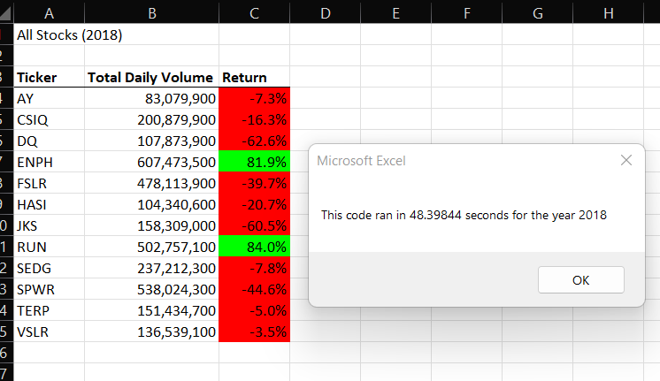

# Module 2 Challenge #

## Overview of the Project: Purpose of the project ##

Our friend Steve would like us to implement the code we developed to display it for the entire list of the stocks given the year.

We have two deliverables: we are to refactor the original code we written to reduce run times, and to make the code scalable to the amount of data there may be given the spreadsheet.

## Results between before and after refactoring ##

The output of the data for 2018 should not change, as refactoring should not change the functionality of the code written. 

Interestingly, we experience longer processing times after we had refactored the code.

The refactored code uses arrays to store information, thus requires more memory to run the code. Every time the For Loop runs on Line 61 of the VBA Challenge code, every time we parse a value into the code we always call upon the array index to find our value.

Before we refactored the code, we used only one array to store the ticker names. I believe that the two reasons why this ran faster is due to limiting the amount of loops that an array has to go through. The ticker is given in the first loop, thus removing the need to constantly cycle through the loop unlike the refactored code.

## Summary ##

A big advantage of refactoring the code is the possibility of making the code run more efficient, and look cleaner. 

The disadvantage of refactoring code is the possibility of breaking the code. Simplifying is great, but if it costs accuracy, it may not be as effective a change.

As stated in the "Results between before and after refactoring", the difference between the two code is the use of arrays and a nested loop. The use of arrays within a for loop drastically increases the computational time as seen in the refactored code. Although arrays may store data, it is unecessary as we do not do anything else with the stored data. 