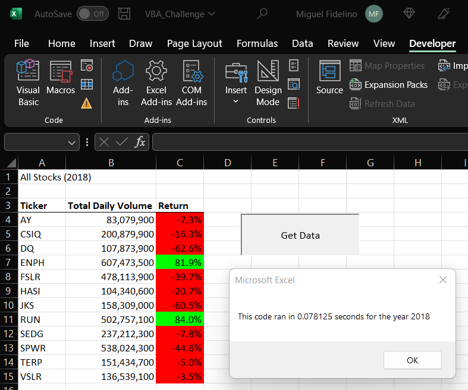

# Module 2 Challenge #

## Overview of the Project: Purpose of the project ##

Our friend Steve would like us to implement the code we developed to display it for the entire list of the stocks given the year.

We have two deliverables: we are to refactor the original code we written to reduce run times, and to make the code scalable to the amount of data there may be given the spreadsheet.

## Results ##

### Before and After Code Refactoring ###

The output of the data for 2017 and 2018 should not change, as refactoring should not change the functionality of the code written.

Before refactoring the code, we experience a wait time of 4.38 seconds before the code completes. After refactoring the code which removes the for-loops from the equation, we experience a processing time of a fraction of a second.

The images below show the difference between 2017 and 2018 stock performance:

In 2017, eleven out of twelve stocks experienced gains. The only stock whcih did not follow this trend was TERP, at a return of -7.2%. Of the stock picks, four of them doubled their return: DQ, ENPH, FSLR, SEDQ; and of these stocks, DQ and SEDG nearly trippled their returns. 

### Stock Analysis ###

The stocks performance of 2017 experienced an average return of 67%, while the median was only 42%. This means that there was a greater likelihood that if you chose a subsample of these stocks, you would range a 42% return. On average, the volumes of all stocks were 263,886,592.

Now we look at the stock performance of 2018:

The stock performance of 2018 were poor, with an average return of -9%. ENPH and RUN were the only two to make a positive return of 81.9% and 84.0% respectively. As the median is -12% and the averge return is -9%, if you were to pick any subsample of these stocks, you would experience a loss of around -12%. An average volume of 275,503,183 is observed in 2018, a 4.4% increase since last year.

In relation between the two years, ENPH has had positive returns for the past two years, averaging a 106% increase for the past two years. ENPH also experienced large volumes in 2018, averaging an inrease of 385,701,400 trades. What I can infers is that ENPH is a stock that is considered a good investment according to other investors, and is at least resilient in the referred two years of the economic cycle.

## Summary ##

A big advantage of refactoring the code is the possibility of making the code run more efficient, and look cleaner. 

The disadvantage of refactoring code is the possibility of breaking the code. Simplifying is great, but if it costs accuracy, it may not be as effective.

As stated in the "Results between before and after refactoring", the difference between the two code is the use of arrays and a nested loop. Without the use of a nested loop, we ran the entire algorithm once over all the rows and storing their values into an array. Before refactoring the code, its inefficiency lies within the nested for-loop. We had to run through all the rows 12 times for each ticker.

After refactoring, we had saved 4.3 seconds, or a reduction of %5,505 of computing time.